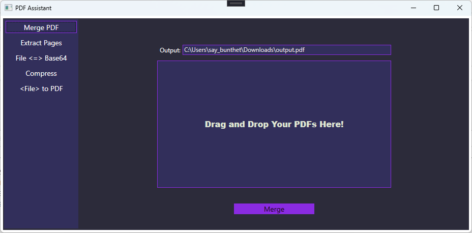

# PDFAssistant 

* Features
	* Merge multiples PDFs
	* Extract pages from a PDF
	* Get the base64 content of a file (PDF, image, ...,etc)
	* Convert a file (image, html, word) to PDF
	* Compress a PDF to reduce it size 
	* OCR a scanned PDF 

		
	

* Technologies
	* WPF application
	* C#
	* .Net Framwork 4.8

* Dependencies
	* ItextSharp 5.5.13.4